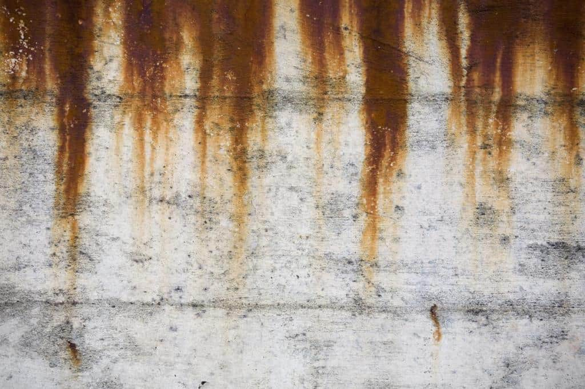

[comment]: # "This is the standard layout for the project, but you can clean this and use your own template"

# DETECTION OF BIOLOGICAL DEGRADATION OF CONCRETE STRUCTURES USING COMPUTER VISION

#### Team

- E/19/371, Shantosh M., [email](mailto:e19371@eng.pdn.ac.lk) [Portfolio](https://www.thecn.com/SM3178)
- E/19/133, Harishanth A., [email](mailto:e19133@eng.pdn.ac.lk), [Portfolio](https://www.thecn.com/HA930)
- E/19/137, Hayanan T., [email](mailto:e19137@eng.pdn.ac.lk), [Portfolio](https://www.thecn.com/TH1357)

#### Supervisors

- Dr. Upul Jayasinghe, [email](mailto:upuljm@eng.pdn.ac.lk )
- Ms.Yasodha Vimukthi, [email](mailto:yasodhav@eng.pdn.ac.lk)
- Dr. J. A. S. C. Jayasinghe, [email](mailto:supunj@eng.pdn.ac.lk )

#### Table of content

1. [Abstract](#abstract)
2. [Introduction](#introduction)
3. [Aim and Objectives](#aim-and-objectives)
5. [Methodology](#methodology)
6. [Conclusion](#conclusion)
7. [Publications](#publications)
8. [Links](#links)

---

<!-- 
DELETE THIS SAMPLE before publishing to GitHub Pages !!!
This is a sample image, to show how to add images to your page. To learn more options, please refer [this](https://projects.ce.pdn.ac.lk/docs/faq/how-to-add-an-image/)
 
-->

## Abstract
Concrete structures are vulnerable to both biological and chemical degradation, which can compromise their durability and structural integrity over time. This research explores the use of computer vision techniques to detect and classify biological degradation, such as algae, mold, and fungi growth, as well as chemical deterioration, including carbonation, sulfate attack, and chloride-induced corrosion. By leveraging deep learning models, image processing algorithms, and pattern recognition techniques, this study aims to develop an automated system for early detection and assessment of concrete degradation. High-resolution image analysis is employed to identify degradation patterns, enhancing the accuracy and efficiency of monitoring methods. The findings of this research could contribute to the development of advanced, data-driven solutions for the proactive maintenance of concrete infrastructure.

## Introduction
Concrete is a fundamental material in modern infrastructure, used in bridges, buildings, roads, and dams due to its strength and durability. However, prolonged environmental exposure leads to biological and chemical degradation, impacting structural safety and longevity. Biological degradation occurs due to the growth of microorganisms such as algae, fungi, and bacteria, which cause surface damage and cracks. Chemical degradation, including sulfate attack, chloride-induced corrosion, and carbonation, alters the material’s composition, leading to deterioration. Traditional inspection methods, such as manual assessments and non-destructive testing (NDT), often lack efficiency and scalability, necessitating automated, real-time monitoring solutions.

Computer vision and deep learning technologies offer high-precision damage detection for concrete structures. These advancements enable automated image analysis to identify cracks, discoloration, and degradation patterns with greater accuracy. Deep learning models, including CNN-based architectures (e.g., ResNet, EfficientNet) and object detection models (e.g., YOLO, Faster R-CNN), improve classification and detection capabilities. While existing research primarily focuses on mechanical damage such as cracks and corrosion, limited studies address biological degradation. Additionally, a comprehensive approach to chemical degradation detection is needed. This research integrates both aspects into a unified system for enhanced structural monitoring and predictive maintenance.

## Aim and Objectives

### Aim

This research aims to develop a computer vision framework for accurate detection and quantification of biological and chemical degradation in concrete structures. By integrating deep learning and multimodal imaging techniques, the proposed system will enhance real-time structural health monitoring, improving the efficiency and accuracy of infrastructure maintenance.

### Objectives

#### General Objective

To design and implement a deep learning-based system that utilizes computer vision and advanced imaging techniques for comprehensive detection, classification, and analysis of biological and chemical degradation in concrete structures.

#### Specific Objectives

1. **Dataset Development:** Collect real-world images of biological and chemical degradation from industrial sites and public datasets while employing synthetic data augmentation to enhance model generalization. Multimodal imaging techniques, such as RGB and thermal imaging, will be used to capture various degradation characteristics.

2. **Deep Learning Model Implementation:** Implement and evaluate deep learning models, including CNNs for image classification, YOLO for real-time object detection, and U-Net for semantic segmentation. These models will be trained to differentiate biological growth (e.g., algae, mold) from chemical damage (e.g., sulfate attack, chloride-induced corrosion).

3. **Degradation Quantification:** Develop methods for measuring degradation severity using computer vision-based feature extraction techniques. Image processing algorithms will analyze surface texture, color variations, and spectral signatures to assess damage extent, providing actionable insights for maintenance planning.

4. **Real-Time Monitoring and Optimization:** Optimize AI models for real-time performance and deployment on mobile devices, drones, and embedded inspection systems. Techniques such as model pruning, quantization, and edge AI integration will be explored to ensure efficiency with minimal computational overhead.

5. **Performance Evaluation and Validation:** Conduct extensive testing using real-world datasets to validate model accuracy, precision, recall, and robustness under different environmental conditions, such as lighting, moisture levels, and surface textures. Comparisons will be made against traditional inspection methods.

7. **Prototype Development for Practical Application:** Develop a functional prototype with a user-friendly interface, allowing users to upload concrete surface images for degradation analysis. The system will be designed for scalability, enabling integration into existing structural health monitoring frameworks used by engineers and maintenance teams.

By addressing these objectives, this research aims to transform traditional structural monitoring into an intelligent, automated, and scalable solution, enhancing the efficiency of concrete degradation assessment and long-term infrastructure sustainability.

[//]: ## Related works

## Methodology
The research methodology for developing a deep learning-based system for detecting and quantifying biological and chemical degradation in concrete structures involves several structured stages. The below Figure explained the stages encompass data collection, data pre-processing and annotation, model development, training and evaluation, and system validation. The methodology is designed to ensure the development of a robust, scalable, and efficient system for structural health monitoring.

  

<b>Methodology Workflow:</b> Synthetic Data Integration, Deep Learning Optimization, and Multi-Metric Evaluation Framework

### Data Collection

Data collection is a crucial step in the methodology, as the quality and diversity of data directly influence the performance of deep learning models. The research begins by gathering real-world images from infrastructure sites, such as bridges, highways, and industrial buildings, where concrete degradation is common. To address the gap in existing datasets, which primarily focus on mechanical damage like cracks and spalling, we collected real images of concrete affected by chemical degradation, specifically chloride and sulfate attacks. Additionally, we generated synthetic images for both chloride and sulfate attacks to augment the dataset, ensuring a broader representation of these degradation types. Segmentation was also performed on the real images to isolate affected areas, aiding in model training and analysis. Multimodal imaging techniques, including RGB imaging and thermal imaging, were employed to capture detailed information on surface textures and temperature variations of the concrete surface, respectively. Below are sample images showcasing real, segmented, and synthetic data for chloride and sulfate attacks:

- **Chloride Attack Samples**:
  <table>
    <tr>
      <td></td>
      <td></td>
      <td></td>
    </tr>
    <tr>
      <td align="center">Real Image</td>
      <td align="center">Segmented Image</td>
      <td align="center">Synthetic Image</td>
    </tr>
  </table>

- **Sulfate Attack Samples**:
  <table>
    <tr>
      <td></td>
      <td></td>
      <td></td>
    </tr>
    <tr>
      <td align="center">Real Image</td>
      <td align="center">Segmented Image</td>
      <td align="center">Synthetic Image</td>
    </tr>
  </table>

#### Residual Strength Calculation for Dataset Labeling

To label the images in the dataset and quantify the extent of chemical degradation, we calculate the residual strength of concrete affected by various reagents (HCl, NaCl, H₂SO₄, and MgSO₄). This method, adapted from *“Colour-stability analysis for estimation of deterioration in concrete due to chemical attack”* by Banerjee et al. (Construction and Building Materials, 2022), involves converting RGB pixel values from segmented images to the CIE-LAB color space and using polynomial equations to estimate residual strength. The process is as follows:

1. **Color Space Conversion**:
   - RGB to CIE-XYZ, with \( R \), \( G \), \( B \) normalized to [0, 1]:
     - **X (RGB to CIE-XYZ)**:  
       \[
       X = 0.41245 * R + 0.35758 * G + 0.18042 * B
       \]
     - **Y (RGB to CIE-XYZ)**:  
       \[
       Y = 0.21267 * R + 0.71516 * G + 0.07217 * B
       \]
     - **Z (RGB to CIE-XYZ)**:  
       \[
       Z = 0.01933 * R + 0.11919 * G + 0.95023 * B
       \]
   - CIE-XYZ to CIE-LAB, using reference white points \( X_0 = 94.811 \), \( Y_0 = 100 \), \( Z_0 = 1017.304 \):
     - **\( L^* \) (CIE-XYZ to CIE-LAB)**:  
       \[
       L^* = 116 * (Y/Y_0)^(1/3) - 16
       \]
     - **\( a^* \) (CIE-XYZ to CIE-LAB)**:  
       \[
       a^* = 500 * ((X/X_0)^(1/3) - (Y/Y_0)^(1/3))
       \]
     - **\( b^* \) (CIE-XYZ to CIE-LAB)**:  
       \[
       b^* = 200 * ((Y/Y_0)^(1/3) - (Z/Z_0)^(1/3))
       \]

2. **Residual Strength Calculation**:
   - Residual strength is calculated for each pixel using \( L^* \) (for HCl) or \( b^* \) (for NaCl, H₂SO₄, MgSO₄) with the following polynomial equations:
     - **HCl (using \( L^* \))**:  
       \[
       y = -0.0051x^3 + 0.8722x^2 - 49.307x + 946.72
       \]
     - **NaCl (using \( b^* \))**:  
       \[
       y = -0.0183x^3 + 0.4962x^2 - 3.6565x + 43.551
       \]
     - **H₂SO₄ (using \( b^* \))**:  
       \[
       y = 0.0636x^3 - 1.2906x^2 + 6.1804x + 31.701
       \]
     - **MgSO₄ (using \( b^* \))**:  
       \[
       y = -4.0564x^4 + 55.836x^3 - 262.76x^2 + 507.92x - 304.49
       \]
   - The strength values are in MPa (Megapascals), with a minimum of 0 to ensure physical validity. The average residual strength for each reagent is computed across all pixels in the segmented region of an image.
3. **Dataset Labeling**:
   - The calculated average residual strengths (for HCl, NaCl, H₂SO₄, and MgSO₄) are stored in a CSV file along with the average \( L^* \) and \( b^* \) values for each image. This data is used to label images based on the severity of degradation, enabling the deep learning model to classify and predict concrete deterioration levels.

This approach ensures that the dataset captures both visual and quantitative aspects of chemical degradation, enhancing the model's ability to detect and assess concrete damage in real-world scenarios.

### Data Pre-processing and Annotation
After data collection, the images undergo pre-processing to improve their quality and make them suitable for deep learning. This step includes noise reduction, contrast enhancement, and normalization of images to address inconsistencies that might affect model performance. The pre-processing ensures that the images are clear and of consistent quality across the dataset. Following pre-processing, expert annotations are carried out to label images according to the type of degradation (e.g., microbial growth, chemical attack). Additionally, image segmentation techniques are applied to segment out areas of degradation, allowing the model to focus on these regions during training. This segmentation is crucial for tasks that involve detecting localized degradation patterns, as it helps the model differentiate between degraded and non-degraded areas on the concrete surface.

### Model Development
In this stage, various deep learning models are developed to detect and classify degradation patterns. The study primarily explores Convolutional Neural Networks (CNNs) for feature extraction, as CNNs are highly effective for processing and identifying spatial patterns in image data. To tackle the challenge of real-time degradation detection, the You Only Look Once (YOLO) architecture is also explored. YOLO is a fast and efficient object detection algorithm that enables the system to detect multiple degradation types in a single pass, making it suitable for real-time applications. Additionally, U-Net, a popular architecture for image segmentation, is employed for pixel-level localization of degradation areas, which is essential for accurately quantifying the extent of damage. To further enhance the models' capabilities, transfer learning is applied. Pre-trained models (such as those trained on large-scale datasets like ImageNet) are fine-tuned on the degradation dataset, which helps in leveraging learned features for more efficient training and better performance.

### Model Training and Evaluation
Training the deep learning models involves feeding the pre-processed and annotated images into the selected architectures. During the training process, various hyper-parameters, such as learning rate, batch size, and epochs, are tuned to optimize the model's performance. The dataset is augmented using techniques like rotation, scaling, and flipping, which helps the model generalize across diverse concrete surfaces and environmental conditions. Once the model is trained, it is evaluated using metrics like accuracy, precision, recall, and Intersection over Union (IoU) to assess how well it detects and classifies degradation types. Cross-validation is also performed to ensure that the model generalizes well to unseen data and avoids overfitting. The evaluation process helps identify potential areas of improvement and ensures that the model achieves high performance in both classification and segmentation tasks.

### System Validation and Testing
The final stage of the methodology involves validating the developed system in real-world conditions. The trained model is integrated into a prototype application designed for degradation detection. The system is deployed on concrete surfaces in various environmental conditions to assess its performance in practical settings. The predictions made by the model are compared with the ground truth data from manual inspections to verify its accuracy and reliability. Additionally, the system’s performance is benchmarked against existing methods used in structural health monitoring to demonstrate its superiority. The system is also evaluated for scalability, with considerations made for deploying it on large-scale infrastructure projects, ensuring that it can handle high volumes of data and operate efficiently.

Through these stages, the research aims to create an accurate, scalable, and efficient  solution for the early detection of both biological and chemical degradation in concrete structures, thereby enhancing the long-term durability and maintenance of infrastructure.

[//]: ## Experiment Setup and Implementation

[//]: ## Results and Analysis

## Conclusion
This research investigates the integration of computer vision and deep learning technologies to address the challenges of detecting and quantifying both biological and chemical degradation in concrete structures. The study aims to bridge the gap in current inspection methodologies by developing a scalable solution for structural health monitoring. By incorporating advanced deep learning models, including object detection and segmentation techniques, alongside multimodal imaging data such as thermal imaging, the proposed approach enhances the accuracy of degradation detection. The use of these innovative techniques allows for the identification of surface and subsurface damage, enabling a more comprehensive understanding of the structural health of concrete. This framework not only addresses the limitations of traditional inspection methods but also offers a promising pathway to improve the efficiency and effectiveness of infrastructure maintenance, potentially leading to significant cost savings and increased longevity of concrete structures.

## Publications
1.	Ai, D., Jiang, G., Lam, S.-K., He, P. & Li, C. (2023). Computer vision framework for crack detection of civil infrastructure—A review. Engineering Applications of Artificial Intelligence, 117, 105478. https://doi.org/10.1016/j.engappai.2022.105478
2.	A. Hafidi, B. Hilloulin, S. Boudache, U. Rejoice, and A. Loukili, "Comparison of Machine Learning Algorithms for the Prediction of the External Sulphate Attack Resistance of Blended Cements," , Milos Island, Greece, Jun. 2023, pp. 725–735.
3.	A. N. Beskopylny, S. A. Stel’makh, E. M. Shcherban’, I. Razveeva, A. Kozhakin, B. Meskhi, A. Chernil’nik, D. Elshaeva, O. Ananova, M. Girya, T. Nurkhabinov, and N. Beskopylny, “Computer Vision Method for Automatic Detection of Microstructure Defects of Concrete,” Materials, 15(8), 2022.
4.	A. Samantaray, B. Yang, J. E. Dietz, and B.-C. Min, “Algae Detection Using Computer Vision and Deep Learning,” Proceedings of the IEEE International Conference on Robotics and Automation, 2022.
5.	A. Ullah, Z. Sun, H. Elahi, F. Afzal, A. Khatoon, N. Sayed, and I. Ahmad, "Experimental and Numerical Research of Paved Microcrack Using Histogram Equalization for Detection and Segmentation," Journal of Sensors, 2022, p. 2684983, Jun. 2022.
6.	C. Chen and P. Shen, "Research on Crack Width Measurement Based on Binocular Vision and Improved DeeplabV3+," Appl. Sci., 13(5), p. 2752, Feb. 2023.
7.	G. Dua and R. Mulaveesala, "Thermal wave imaging for non-destructive testing and evaluation of reinforced concrete structures," Insight - Non-Destructive Testing and Condition Monitoring, 60(5), pp. 252–256, May 2018.
8.	H. Kabir, J. Wu, S. Dahal, T. Joo, and N. Garg, "Automated estimation of cementitious sorptivity via computer vision," Nature Communications, 15, article no. 9935, 2024.
9.	J. F. Ramirez Rochac, N. Zhang, L. Thompson, and T. Oladunni, "A Data Augmentation-Assisted Deep Learning Model for High Dimensional and Highly Imbalanced Hyperspectral Imaging Data," Hulunbuir, China, 2019.
10.	J. Im, W. Kim, S. Park, and S. Park, “Detection of Structural Damage of Infrared Thermal Image Using Computer Vision,” Journal of Building Engineering, 48, 2022.
11.	J. Nádvorník, P. Škoda, and P. Tvrdík, "Hierarchical Semi-Sparse Cubes—Parallel Framework for Storing Multi-Modal Big Data in HDF5," IEEE Access, 11, pp. 119876–119897, Jan. 2023.
12.	J. Wang, T. Ueda, P. Wang, Z. Li, and Y. Li, "Building damage inspection method using UAV-based data acquisition and deep learning-based crack detection," Journal of Civil Structural Health Monitoring, 15, pp. 151–171, 2025.
13.	K. Dunphy, M. N. Fekri, K. Grolinger, and A. Sadhu, "Data Augmentation for Deep-Learning-Based Multiclass Structural Damage Detection Using Limited Information," Sensors, 22(16), p. 6193, Aug. 2022.
14.	Krishnan, S. S. R., Karuppan, M. K. N., Khadidos, A. O., Selvarajan, S., Tandon, S. & Balusamy, B. (2025). Comparative analysis of deep learning models for crack detection in buildings. Scientific Reports, 15(1), Article 2125. https://doi.org/10.1038/s41598-025-85983-3
15.	R. Fu, H. Xu, Z. Wang, L. Shen, M. Cao, T. Liu, and D. Novák, "Enhanced Intelligent Identification of Concrete Cracks Using Multi-Layered Image Preprocessing-Aided Convolutional Neural Networks," Sensors, 20(7), p. 2021, 2020.
16.	Reddy, V. G. P., Tadepalli, T., & Pancharathi, R. K. (2023). "Surface imaging based non-destructive assessment of concrete deterioration using hue-saturation-intensity colour space." Construction and Building Materials, XYZ, 104651.
17.	S. Pozzer, G. Ramos, E. R. Azar, A. Osman, A. El Refai, F. López, C. Ibarra-Castanedo, and X. Maldague, "Enhancing concrete defect segmentation using multimodal data and Siamese Neural Networks," Automation in Construction, 166, p. 105594, Oct. 2024.
18.	S. Zhang, "The Performance and Service Life Prediction of High Performance Concrete in Sulfate and Acidic Environments," FIU Electronic Theses and Dissertations, 2015.
19.	T. G. Mondal and G. Chen, "Artificial intelligence in civil infrastructure health monitoring—Historical perspectives, current trends, and future visions," Front. Built Environ., 8, Sept. 2022.
20.	T. Lee, D. Kim, S. Cho, and M. O. Kim, "Advancements in Surface Coatings and Inspection Technologies for Extending the Service Life of Concrete Structures in Marine Environments: A Critical Review," Buildings, 15(3), p. 304, Mar. 2025.
21.	T. Malche, S. Tharewal, and R. K. Dhanaraj, “Automated Damage Detection on Concrete Structures Using Computer Vision and Drone Imagery,” Sensors, 22(14), 2022.
22.	T. Zarg, S., Pundir, P., Rathee, G., Ahlawat, S., & et al., "On Continuous Integration / Continuous Delivery for Automated Deployment of Machine Learning Models using MLOps," 2021 IEEE Fourth International Conference on Artificial Intelligence and Knowledge Engineering (AIKE), 2021.
23.	T. Li, Y. Yu, J. Li, Y. Xia, Z. Ding, and B. Samali, "Automated damage diagnosis of concrete jack arch beam using optimized deep stacked autoencoders and multi-sensor fusion," Developments in the Built Environment, 14, p. 100128, Apr. 2023.
24.	T. A. Mukhti, K. P. V. Robles, K.-H. Lee, and S.-H. Kee, "Evaluation of Early Concrete Damage Caused by Chloride-Induced Steel Corrosion Using a Deep Learning Approach Based on RNN for Ultrasonic Pulse Waves," Materials, 16(9), p. 3502, May 2023.
25.	T.-H. Kim, J. E. Min, H. M. Lee, K. J. Kim, and C.-S. Yang, “Application of hyperspectral image for monitoring in coastal area with deep learning: A case study of green algae on artificial structure,” J. Mar. Sci. Eng., vol. 12, no. 11, p. 2042, 2024. [Online]. Available: https://doi.org/10.3390/jmse12112042
26.	T. E. Dietz, A. Samantaray, B. Yang, and B.-C. Min, "Algae detection using computer vision and deep learning," preprint arXiv:1811.10847, doi: 10.48550/arXiv.1811.10847 , Nov. 2018.
27.	T. Kukletová and I. Chromková, "Testing of algae colonization growth risk on building materials," IOP Conference Series: Materials Science and Engineering, vol. 379, p. 012041, 2018.
28.	T. Bertovic, ``Human factors in non-destructive testing (NDT): Risks and challenges of mechanised NDT,'' Ph.D. dissertation, Technische Universität Berlin, 2015.
29.	T. Shahrizan Jamaludin, Md Mahadi Hasan Imran, Ahmad Ali Imran Mohd Ali, “Computer Vision and Image Processing Approaches for Corrosion Detection," Journal of Marine Science and Engineering, vol. 11, no. 10, p. 1954, Oct. 2023.
30.	W. Martínez-Molina, J. A. Guzmán-Torres, F. J. Domínguez-Mota, M. Z. Naser, G. Tinoco-Guerrero, and J. G. Tinoco-Ruíz, "Damage detection on steel-reinforced concrete produced by corrosion via YOLOv3: A detailed guide," Frontiers in Built Environment, vol. 9, Mar. 2023.
31.	W. Al Fuhaid, A. F., Niaz, A. (2022). Carbonation and Corrosion Problems in Reinforced Concrete Structures. Buildings, 12(5), 586.
32.	W. Martínez-Molina, J. A. Guzmán-Torres, F. J. Domínguez-Mota,, M. Z. Naser, G. Tinoco-Guerrero, and J. G. Tinoco-Ruíz, "Damage detection on steel-reinforced concrete produced by corrosion via YOLOv3: A detailed guide," Frontiers in Built Environment, vol. 9, Mar. 2023.
33.	Y. Haddad, G. Jokhio, and A. Abu Tair, "Overview of Concrete Deterioration Due to Sulphate Attack and Comparison of Its Requirements in International Codes," in BUiD Doctoral Research Conference 2022, May 2023.
34.	YTL Group Qatar, "Chloride attacks on concrete structures," YTL Group Qatar, [Online].Available:https://www.ctlgroupqatar.com/single-post/2019/02/02/chloride-attacks-on-concrete-structures.
35.	Zarkham Global, "Concrete carbonation: Why should I care?," Zarkham Global, [Online]. Available: https://markhamglobal.com/news/concrete-carbonation-why-should-i-care/.
36.	Z.V. Mohan, “Performance Analysis of Canny and Sobel Edge Detection Algorithms in Image Mining,” International Journal of Innovative Research in Computer and Communication Engineering, vol. 1, no. 8, pp. 1760–1767, Oct. 2013.

## Links

[//]: # ( NOTE: EDIT THIS LINKS WITH YOUR REPO DETAILS )

- [Project Repository](https://github.com/cepdnaclk/e19-4yp-Detection-of-Biological-Degradation-on-Concrete-Structures-Using-Computer-Vision)
- [Project Page](https://cepdnaclk.github.io/e19-4yp-Detection-of-Biological-Degradation-on-Concrete-Structures-Using-Computer-Vision)
- [Department of Computer Engineering](http://www.ce.pdn.ac.lk/)
- [University of Peradeniya](https://eng.pdn.ac.lk/)

[//]: # "Please refer this to learn more about Markdown syntax"
[//]: # "https://github.com/adam-p/markdown-here/wiki/Markdown-Cheatsheet"
